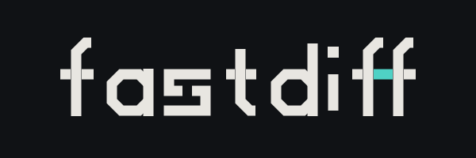
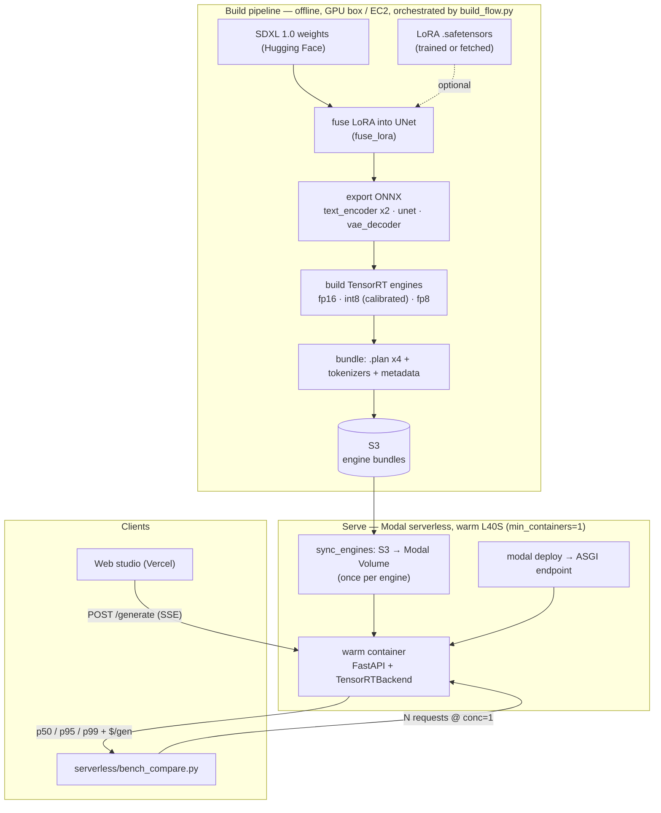
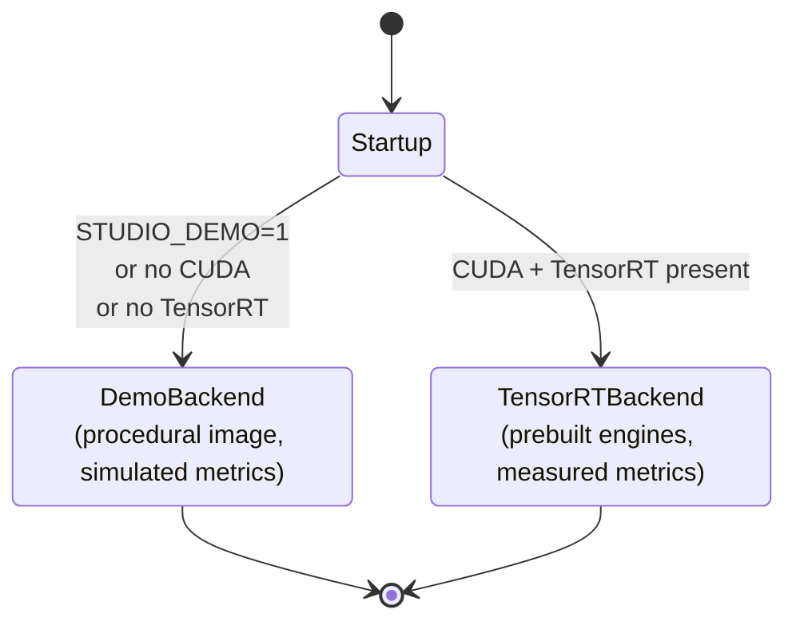
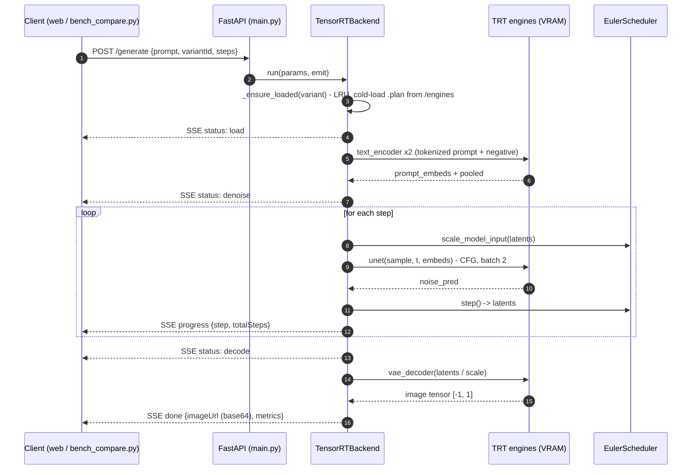
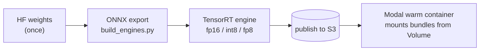

<a id="readme-top"></a>

<p align="center">
  
</p>

<div align="center">
  <p>Benchmarking the p95 latency, VRAM, and quality tradeoff of quantised SDXL — served as TensorRT engines on GPU.</p>
  <a href="https://www.python.org/">
    </a>
  <a href="https://developer.nvidia.com/tensorrt">
    </a>
  <a href="https://nextjs.org/">
    </a>
  <a href="https://github.com/aqilmarwan/fastdiff/blob/main/LICENSE">
    </a>
  <a href="">
    </a>
  <h4>
    <a href="https://fastdiff.vercel.app">Live demo</a>
  </h4>
</div>


> [!NOTE]
> The **demo plane** runs the entire studio on CPU with **zero GPUs** — `docker compose up` and go. GPUs are only needed to build engines and to serve/benchmark the real (TensorRT) plane.
> Huge migration has been done after few iterations of this project. Since AWS is new in ap-southeast-5, P and G GPU instances required for serving p95/p98 is limited.

> [!WARNING]
> **Status:** the **FP16** variants are validated end-to-end (build → serve → correct image → benchmark). **INT8** (entropy calibration) and **FP8** (ModelOpt Q/DQ) are in progress and currently build as FP16 fallbacks, so their latency numbers aren't yet distinct. The demo plane is what CI exercises.


# Table of contents

[Overview](#overview)

[How it works](#how-it-works)

- [Two planes](#two-planes)
- [Serving](#serving)
- [Build pipeline](#build-pipeline)
- [Infrastructure](#infrastructure)

[Variants](#variants)

[Running locally](#running-locally)

- [Requirements](#requirements)
- [Demo plane](#demo-plane)
- [Tests](#tests)

[Building engines](#building-engines)

[Deploying to Modal](#deploying-to-modal)

[Benchmarking](#benchmarking)

[Repository layout](#repository-layout)

[License](#license)

[Authors](#authors)

[Credits](#credits)

[back to top](#readme-top)

---


## Overview

**fastdiff** exists to answer one question with real numbers: *what does quantising
SDXL actually cost you, and what does it buy?* It serves the same SDXL 1.0 model as
a matrix of **precision × style** TensorRT engines — FP16, INT8, FP8, each as Base
or LoRA — and measures the tradeoff for each on **consistent, dedicated GPU
hardware**: p50/p95/p99 latency, peak VRAM, and quality.

Latency is the deliverable, so two things matter:

- **The engines are prebuilt TensorRT** `.plan` **files.** There is no Hugging Face or
`diffusers` at serving time — the text encoders, UNet, and VAE run as engines and
the scheduler is vendored. That strips framework overhead out of the measurement.
- **It runs on a warm, pinned L40S (Modal serverless, `min_containers=1`).** One
dedicated, always-warm card gives reproducible p95 instead of cold-start and
run-to-run allocation variance.

A web studio (studio + compare pages) streams generations over SSE and renders the
metrics side by side; `serverless/bench_compare.py` produces the percentile tables.

[back to top](#readme-top)

---


## How it works

The system is three stages — **build** engines offline, **serve** them on a warm
L40S (Modal serverless), and **benchmark**:




### Two planes

The service picks its backend at startup, so the exact same product runs with or
without a GPU:


| Plane    | When                        | Backend                                       | GPU  |
| -------- | --------------------------- | --------------------------------------------- | ---- |
| **demo** | no CUDA, or `STUDIO_DEMO=1` | seeded procedural renderer, simulated metrics | none |
| **real** | CUDA + TensorRT present     | prebuilt TRT engines, measured metrics        | yes  |


The demo plane makes the whole frontend exercisable in local dev and CI; its
metrics are derived from the registry and clearly logged as simulated. The backend
is chosen once at startup:




### Serving

`inference/` is a FastAPI service exposing three endpoints :- 

- `GET /variants`

- `POST /generate` (SSE)

- `GET /healthz`

`TensorRTBackend` keeps an LRU set of  
engine bundles hot in VRAM (`max_resident`), runs the denoise loop, and measures  
cold-load / denoise / VAE latency, throughput, and peak VRAM around the real work.  
Engine bundles are synced once from S3 into the Modal Volume the warm container  
mounts — nothing is downloaded from Hugging Face at request time. A single  
`POST /generate` on the real plane flows like this:




### Build pipeline

`pipelines/` turns the base checkpoint into the servable engines. This is offline
and **not** latency-critical, so it can run anywhere with a GPU:




`build_flow.py` (Metaflow + Ray) orchestrates train-LoRA → build → benchmark on any
CUDA GPU. Only the UNet is quantised; the VAE (fp16-fix) and text encoders stay FP16.

### Infrastructure

Serving runs on **Modal serverless**: a warm L40S container (`min_containers=1`)
mounts the engine bundles from a Modal Volume (synced once from S3) and serves the
FastAPI app as an HTTPS ASGI endpoint. One dedicated, pinned card = reproducible
latency, with no cluster, GPU quota, or image registry to manage. The web app is
hosted separately on Vercel. `serverless/runpod_handler.py` is an equivalent RunPod
deployment reading the same engines from S3.

[back to top](#readme-top)

---


## Variants

The precision × style matrix served by `GET /variants`. Numbers are the target
tradeoff on a single L40S (the build flow measures and syncs them into
`inference/variants.yaml`):


| Variant     | Precision | Style | Size    | Peak VRAM | Throughput | Quality | Status             |
| ----------- | --------- | ----- | ------- | --------- | ---------- | ------- | ------------------ |
| FP16 · Base | FP16      | Base  | 13.0 GB | 18.4 GB   | 7.8 it/s   | 98      | ✅ validated        |
| FP16 · LoRA | FP16      | LoRA  | 13.2 GB | 18.7 GB   | 7.6 it/s   | 97      | ✅ validated        |
| INT8 · Base | INT8      | Base  | 7.1 GB  | 11.2 GB   | 12.6 it/s  | 95      | 🚧 calibration WIP |
| FP8 · Base  | FP8       | Base  | 6.6 GB  | 9.6 GB    | 16.4 it/s  | 92      | 🚧 needs ModelOpt  |
| FP8 · LoRA  | FP8       | LoRA  | 6.8 GB  | 9.9 GB    | 15.8 it/s  | 90      | 🚧 needs ModelOpt  |


> [!NOTE]
> Only the UNet is quantised; the VAE and text encoders stay FP16. `quality` is a
> CLIP image-text score normalised against FP16 — i.e. *fidelity retained vs FP16*.

[back to top](#readme-top)

---


## Running locally


### Requirements

- Docker (for the one-command demo), or Python 3.11 + Node 20 / pnpm for dev.
- **No GPU and no model downloads** are needed for anything in this section.


### Demo plane

The fastest path — inference (demo) + web, on CPU:

```bash
docker compose -f docker/docker-compose.yml up --build
# open http://localhost:3000
```

Or run the two services directly:

```bash
# inference (demo plane)
cd inference && pip install -r requirements.txt
STUDIO_DEMO=1 uvicorn main:app --port 8000

# web
cd web && pnpm install && pnpm dev   # http://localhost:3000
```

If the API is unreachable, the studio transparently falls back to in-browser demo
data, so the frontend is always usable.

### Tests

```bash
cd inference && STUDIO_DEMO=1 pytest -q     # API + smoke tests (demo plane)
cd web && pnpm lint && pnpm build           # lint + typecheck + build
```

[back to top](#readme-top)

---


## Building engines

Build the engines once on any L40S GPU box, publish to S3, then point the serving
plane at the bucket (Modal syncs them into its Volume). Building isn't
latency-sensitive, but the `.plan` files are device-specific — build on the same
GPU class you serve on (L40S):

```bash
pip install -r pipelines/requirements.txt -r inference/requirements.txt -r inference/requirements-gpu.txt

# build every variant, publish .plan bundles to S3, sync measured metrics back
python pipelines/build_flow.py run --sync --engine-s3 s3://<bucket>
```

**LoRA** is fused into the engine at build time, so a pre-trained SDXL LoRA works
with no dataset — `./pipelines/fetch_lora.sh` grabs one, then build with `--skip-train`.
To train your own, add instance images under `pipelines/data/<name>/` (see
`pipelines/data/README.md`) and drop `--skip-train`.

> The build-time TensorRT version **must match** the serving runtime (both 10.3),
> since `.plan` engines aren't portable across major versions.

[back to top](#readme-top)

---


## Deploying to Modal

Serving runs on **Modal serverless** on an **L40S**, kept warm (`min_containers=1`)
for a stable p95. Modal supplies the GPU and a persistent Volume for the engines;
the FastAPI app from `inference/main.py` is served verbatim as a Modal ASGI
endpoint (`serverless/modal_app.py`). No cluster, no quota, no image registry.

```bash
# 1. one-time: store a read-only S3 key so Modal can pull the engines
modal secret create aws-s3-readonly \
  AWS_ACCESS_KEY_ID=... AWS_SECRET_ACCESS_KEY=... AWS_DEFAULT_REGION=ap-southeast-5

# 2. one-time per engine: sync the .plan bundle from S3 into the Modal Volume
modal run serverless/modal_app.py::sync_engines --engine fp16-base

# 3. deploy the warm endpoint (prints the https URL)
modal deploy serverless/modal_app.py
```

> [!NOTE]
> The engines are TensorRT `.plan` files built for the **L40S**, so serving pins
> L40S (or L40 — same Ada arch). A different GPU class runs a slow, wrong-device
> fallback. `serverless/runpod_handler.py` is an equivalent RunPod deployment that
> pulls the same engines from S3.

[back to top](#readme-top)

---


## Benchmarking

The whole point — `serverless/bench_compare.py` fires N generations against the
warm endpoint and reports p50/p95/p99 of the end-to-end wall time and the
server-measured denoise time (network-independent), plus a derived $/generation:

```bash
URL=https://<your-app>.modal.run
python3 -u serverless/bench_compare.py --url $URL --label modal \
  --variant fp16-base --n 20 --steps 30 --gpu L40S --price-per-hour 1.95
```

```text
variant        n   cold   wall p50   p95   p99   denoise p50   p95    vram
fp16-base     50   4200      2100  2400  2600         1850  1980    18.4
int8-base     50   3100      1400  1600  1750         1180  1290    11.2
```

Concurrency (`-c`) drives load so p95/p99 reflect real queueing, not a quiet single
stream. Read the **denoise** columns for hardware-clean numbers — `wall` includes
network (port-forward adds jitter; run from inside the VPC for a clean wall-clock).
`scripts/generate.py` is a one-shot generate-and-save for a quick endpoint check.

[back to top](#readme-top)

---


## License

Distributed under the MIT License. See [LICENSE](https://github.com/aqilmarwan/fastdiff/blob/main/LICENSE) for details.

## Authors

- **Aqil Marwan** — [@aqilmarwan](https://github.com/aqilmarwan)


## Credits

- [Stable Diffusion XL](https://huggingface.co/stabilityai/stable-diffusion-xl-base-1.0) — Stability AI
- [TensorRT](https://developer.nvidia.com/tensorrt) · [diffusers](https://github.com/huggingface/diffusers) · [FastAPI](https://fastapi.tiangolo.com/) · [Next.js](https://nextjs.org/)
- [sdxl-vae-fp16-fix](https://huggingface.co/madebyollin/sdxl-vae-fp16-fix) · Cyberpunk SDXL LoRA — [issaccyj/lora-sdxl-cyberpunk](https://huggingface.co/issaccyj/lora-sdxl-cyberpunk)

[back to top](#readme-top)